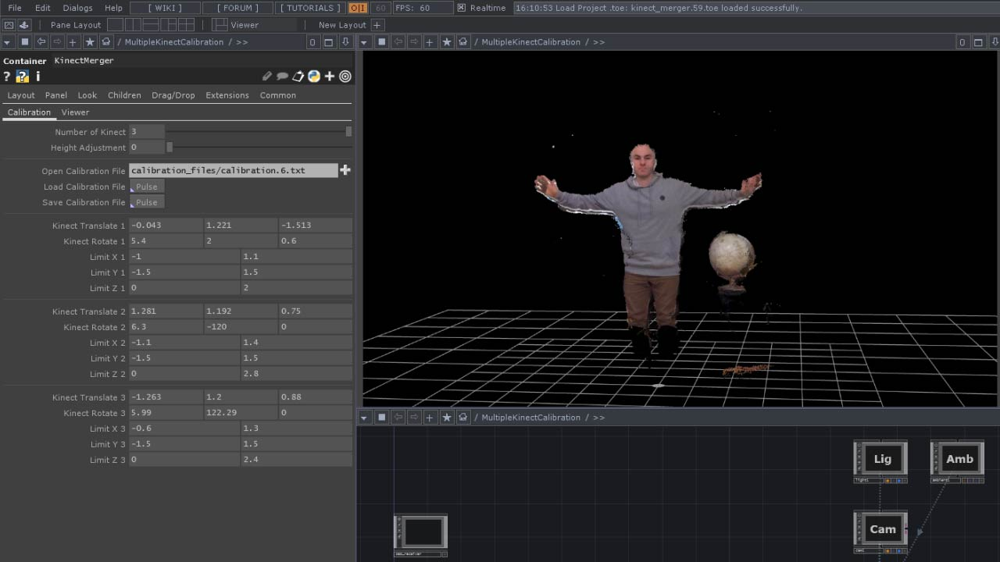
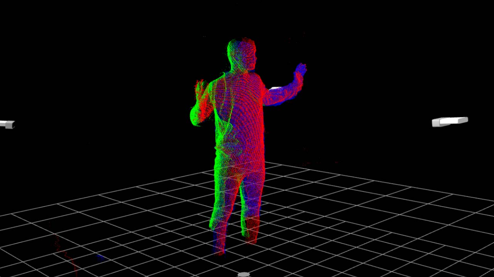
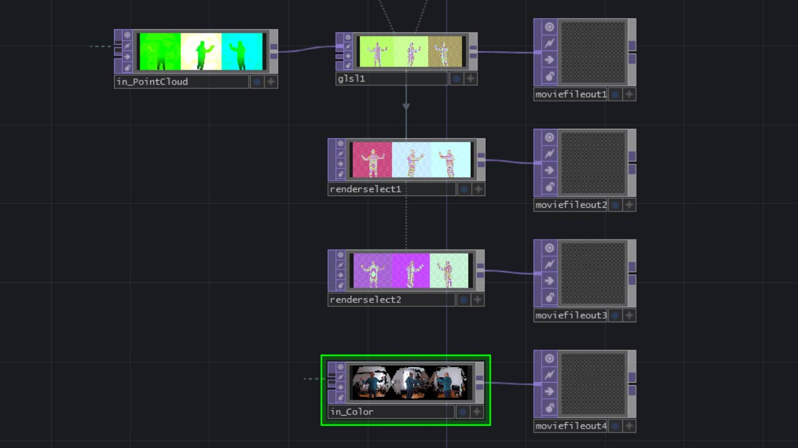

# multiplekinectcalibration_touchdesigner

Una herramienta para la calibración, grabación y reproducción de nubes de puntos utilizando múltiples sensores azure kinect con touchdesigner.

[documentación oficial](https://gitlab.com/v_brault/multiplekinectcalibration_touchdesigner/-/wikis/Multiple-Azure-Kinect-Calibration-Tool)

El parche permite principalmente modificar la posición de las cámaras virtuales según las coordenadas reales de los sensores para poder ensamblar las distintas nubes de puntos.

## requerimientos

* Dos o más dispositivos azure kinect ([documentación de azure kinect dk](https://docs.microsoft.com/en-us/azure/kinect-dk/)).
* Touchdesigner build 2020.20020 ([descarga de la versión](https://derivative.ca/download/archive)).
* Cables de extensión usb 3.0 activos.
* Cables de audio estéreo macho de 1/8 de pulgada (para sincronización).

## características

### calibración
Esta herramienta está diseñada para utilizar 3 sensores. Los parámetros de traslación y rotación cambian la posición de cada cámara. Las coordenadas se pueden guardar en un archivo de texto externo y leerse desde allí. Un umbral de distancia permite limitar el alcance de las nubes de puntos en todos los ejes mediante el uso de cajas delimitadoras.

### visor
Una ventana dedicada permite observar de forma independiente las distintas nubes de puntos. Éstas se pueden renderizar en monocromo blanco, rojo, verde y azul (dependiendo de cada cámara) o con el color de la cámara rgb. También se puede activar una representación visual de la posición de las cámaras, una cuadrícula de dimensiones y la visualización de las cajas delimitadoras.

### grabación y reproducción
Una vez ensambladas, las nubes de puntos se pueden descomprimir según sus valores rgb en 3 videos de 8 bits sin comprimir para su grabación. Estos archivos se pueden volver a empaquetar luego en una secuencia de video de 32 bits para su reproducción en tiempo real. Shaders creados por Quentin Bleton.

## enlaces

* [video de demostración con múltiples kinect](https://www.youtube.com/watch?v=_jaS1KB1Kyg)

## créditos

* Es un desarrollo original de Vincent Brault, adaptado por Tolch.