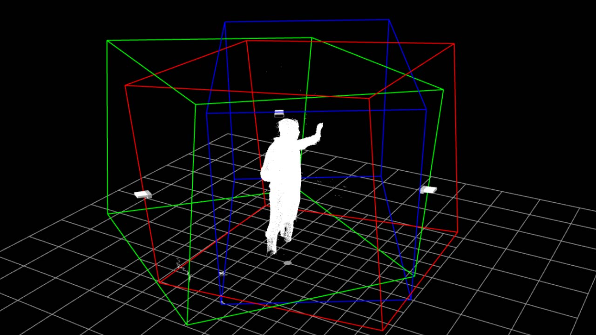

# multiplekinectcalibration_touchdesigner

una herramienta para la calibración, grabación y reproducción de nubes de puntos utilizando múltiples sensores azure kinect con touchdesigner.

[documentación oficial](https://gitlab.com/v_brault/multiplekinectcalibration_touchdesigner/-/wikis/Multiple-Azure-Kinect-Calibration-Tool)

el parche permite principalmente modificar la posición de las cámaras virtuales según las coordenadas reales de los sensores para poder ensamblar las distintas nubes de puntos.

## requerimientos

* dos o más dispositivos azure kinect ([documentación de azure kinect dk](https://docs.microsoft.com/en-us/azure/kinect-dk/)).
* touchdesigner build 2020.20020 ([descarga de la versión](https://derivative.ca/download/archive)).
* cables de extensión usb 3.0 activos.
* cables de audio estéreo macho de 1/8 de pulgada (para sincronización).

## características

### calibración
esta herramienta está diseñada para utilizar 3 sensores. los parámetros de traslación y rotación cambian la posición de cada cámara. las coordenadas se pueden guardar en un archivo de texto externo y leerse desde allí. un umbral de distancia permite limitar el alcance de las nubes de puntos en todos los ejes mediante el uso de cajas delimitadoras.

### visor
una ventana dedicada permite observar de forma independiente las distintas nubes de puntos. éstas se pueden renderizar en monocromo blanco, rojo, verde y azul (dependiendo de cada cámara) o con el color de la cámara rgb. también se puede activar una representación visual de la posición de las cámaras, una cuadrícula de dimensiones y la visualización de las cajas delimitadoras.

### grabación y reproducción
una vez ensambladas, las nubes de puntos se pueden descomprimir según sus valores rgb en 3 videos de 8 bits sin comprimir para su grabación. estos archivos se pueden volver a empaquetar luego en una secuencia de video de 32 bits para su reproducción en tiempo real. shaders creados por quentin bleton.

## enlaces

* [video de demostración con múltiples kinect](https://www.youtube.com/watch?v=_jaS1KB1Kyg)

## créditos

* es un desarrollo original de vincent brault, adaptado por tolch.